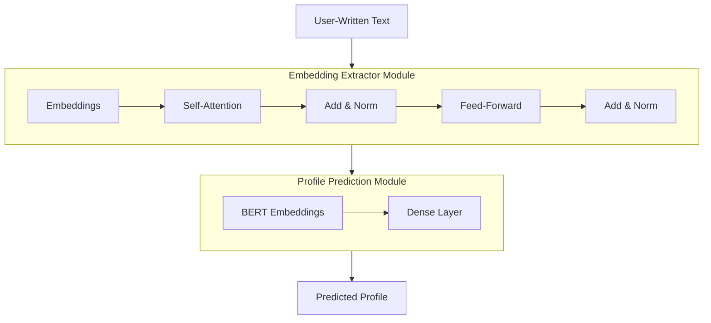

# AI-Based Profile Prediction Model for Social Listening Data Analysis

## Overview

Social media has emerged as a critical data source for extracting consumer insights. However, text data collected from these platforms often lack demographic profile information of the authors, which limits its use in marketing strategies and social science research. This project develops an **AI-based profile prediction model** that estimates demographic attributes (e.g., age, gender) from SNS text data. The model enables more granular analysis of social listening data, thereby supporting precise marketing strategy development and enhancing understanding of social phenomena.


## Key Features

- **Profile prediction with BERT-based models**  
  - Leverages Transformer embeddings to effectively capture user attributes  
- **Automated preprocessing and analysis of SNS text data**  
  - Provides pipelines for tokenization, cleaning, and embedding extraction  
- **Web dashboard**  
  - Visualizes prediction results and provides a user-friendly interface  


## Tech Stack

- **Language/Frameworks**: Python, Streamlit
- **Libraries**: PyTorch, Hugging Face Transformers, Scikit-learn, Pandas  
- **Deployment**: Docker  
- **Visualization**: Matplotlib

## Repository Structure

| File / Folder         | Description                         |
| --------------------- | ----------------------------------- |
| bert_main.py          | BERT embedding extraction script    |
| main.py               | Model training and saving script    |
| streamlit_main.py     | Streamlit web application           |
| data/                 | Data directory                      |
| ├─ final_data.pkl     | Data after embedding extraction     |
| └─ data.csv           | Pre-processed data                  |
| models/               | Saved models and encoders           |
| utils/                | Utility functions                   |
| ├─ model.py           | Model-related functions             |
| ├─ path.py            | Path configuration                  |
| ├─ streamlit_utils.py | Streamlit helper functions          |
| └─ utils.py           | General utility functions           |
| Dockerfile            | Docker image setup                  |
| compose.yml           | Docker Compose configuration        |
| requirements.txt      | Python dependencies                 |
| README.md             | Project description and usage guide |


## System Architecture



## Achievements

- Improved  **accuracy by +40% , F1-score by +20.2%** on average compared to baseline models
- Completed prototype of web dashboard and conducted internal demo  
- Verified applicability to real-world industry data


## Process

- **Project Duration**: 2025.04.07 ~ 2025.07.20
- **Key Milestones**:
    - Week 1–2: Requirements definition & data collection
    - Week 3–6: Data preprocessing & model development
    - Week 7–9: Model training/evaluation & performance improvement
    - Week 10–11: Web dashboard implementation
    - Week 12–13: Integration testing & demo presentation


## Installation & Usage
```bash
# Clone repository
git clone https://github.com/hansung-prism-lab/sw-industry-collab-2025.git
cd sw-industry-collab-2025

# Install dependencies
pip install -r requirements.txt

# Run with Docker
docker compose up --build

# Extract BERT Embeddings
python bert_main.py --dataset data \
                    --type csv \
                    --model_ckpt bert-base-uncased \
                    --chunk_size 10000 \
                    --batch_size 16

# Train the Model
python main.py --dataset final_data \
               --dropout 0.3 \
               --learning_rate 0.0015 \
               --validation_split 0.125 \
               --batch_size 32 \
               --epochs 100

# Visualize the Results
streamlit run streamlit_main.py
```

## Limitations & Future Work

- Currently limited to **text-based single modality** → future extension to **multimodal models (text + image + metadata)**  
- Data imbalance in certain demographic groups → need for **augmentation** and **balanced sampling**  
- Requires further optimization for **inference speed** and **real-time API deployment**  


## Contributors

- **Advisor**  
    - Prof. Qinglong Li (Hansung University)

- **Research Mentor**
    - Haebin Lim (Kyung Hee University) – Ph.D. Candidate 

- **Research Team (Undergraduate)**  
  - Dahee Kim (Hansung University) – Team Leader / Undergraduate Researcher  
  - Yurim Shin (Hansung University) – Undergraduate Researcher  
  - Dayoon Jung (Hansung University) – Undergraduate Researcher  
  - Hanjun Lee (Hansung University) – Undergraduate Researcher  
  - Jonghwa Park (Hansung University) – Undergraduate Researcher


## References

- Devlin, J., Chang, M. W., Lee, K., & Toutanova, K. (2019, June). Bert: Pre-training of deep bidirectional transformers for language understanding. In Proceedings of the 2019 conference of the North American chapter of the association for computational linguistics: human language technologies, volume 1 (long and short papers) (pp. 4171-4186).
- Hugging Face Transformers Documentation: https://huggingface.co/transformers
- PyTorch Documentation: https://pytorch.org/docs/stable/index.html
